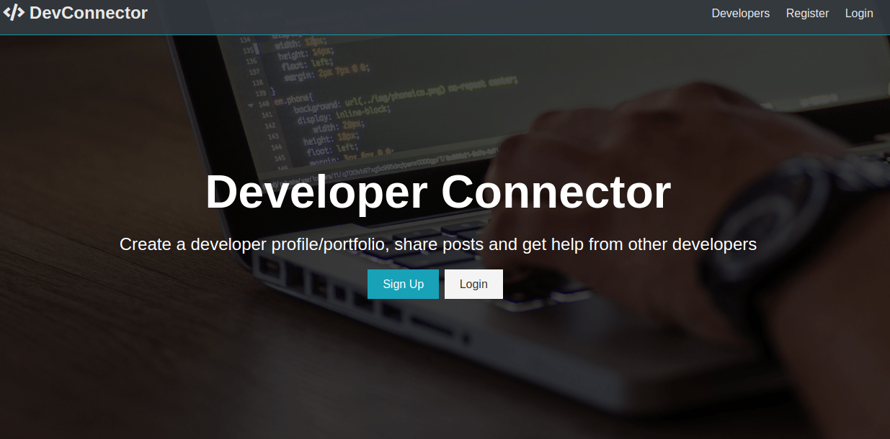

# Developers Connector 

Create a developers profile/portfolio, share posts and get help from other developers

# Tech Stack
- NodeJS
- JavaScript
- MongoDB
- Express
- ReactJS
- Redux

# Overview


# How To Get Started

```bash
git clone git@github.com/kosamtech/devconnector2.0.git
```

```bash
npm install && cd client and npm install
```

```bash
npm start
```

Visit the application on `http://localhost:50000`
